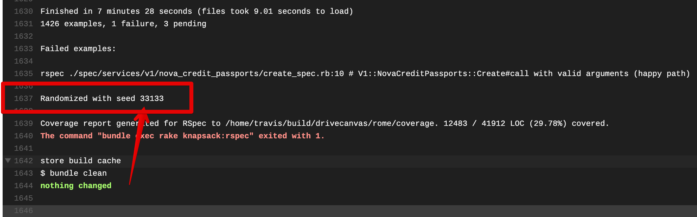

---
layout: post
title: Flaky rspec specs
modified: 2019-7-25
tags: [testing]
comments: true
image:
  feature:
  credit:
  creditlink:
---

I recently got fed up with intermittent test failures piling up in our rails app and decided to do something about it. If you've been writing tests using CI for long enough you're bound to have encountered the problem of intermittent test failures. We’ve all been there, you push up your code to CI and find that your changes have broken the build. Upon investigation you find that it was a test that has nothing to do with your changes.

It's easy to consider them an annoyance--rebuild the build and see if it passes this time. Flaky tests are worse than a small annoyance though, and when not addressed in a timely way can lead to plunging productivity and morale problems. In this post I'd like to motivate why eliminating intermittent test failures is important and arm the reader with the tools to do so.

Upon finishing this, you should feel empowered by gaining a very particular set of skills


### Why are flaky tests a problem?
This seems obvious. Of course flaky tests are bad—they keep breaking my build! That's so annoying!

But I think we can do better than that. We live with small annoyances all the time and that by itself isn’t necessarily a reason to put engineering resources towards something. But is that all it really is?

In fact flaky tests in fact pose more serious problems if left unaddressed for too long:

#### Team morale
It doesn’t just cost us a few seconds of time when we hit rebuild on that failing test suite, it also just feels crappy. You were excited about getting to deploy your thing but now you need to wait for the build to pass (or you cheat and push it anyway). At Canvas we take pride in our work. We engage in rigorous code reviews and perform refactorings based on thoughtful feedback. We write tests. We ship high-quality code. Hitting a flaky test failure is a reminder that we’re not holding ourselves to that same high standard.

#### Slow Feedback Loops
Let’s face it, it really doesn’t take that much time to hit the “rebuild” button in Travis. That’s why we do it. But let’s look at what else happens when you hit that button. Maybe you were making small commits to Travis to see that each of your changes keeps the tests passing (as Carrick recommended a few weeks ago). Well, now you’re going to have to wait another 20 minutes to get that feedback. In that 20 minutes, you could get out of the flow of what you’re doing, be forced to switch to another task or find yourself reading some weird question that you saw a link to on StackExchange. Keeping developer productivity high is not just about preserving engineering time but also about preserving focus.

#### Lack of Trust in tests
In a test suite free of flaky tests, your first thought upon seeing a test failure is “hey, looks like something’s broken—we should fix it right away!”. Flaky tests erode that trust and replace it with the assumption that if a test is failing it’s probably just a flake. This starts to subtly change your perception of what those red and green colors mean. See something merged to master that’s got a failing test? When your test is full of flaky tests, it’s less of a big deal. Our minds are always trying to sort signal from noise and flaky tests make it so that test failures become noise rather than signal—and that’s a dangerous outcome in the long run.

#### Vicious Cycle
To top it all off flaky tests beget flaky tests. Once you have some tests that you’ve gotten used to just rebuilding the build for when they come up, you’ll start doing that with more tests, and it will become increasingly difficult to address them.

Think of a flaky test as a dirty plate in your kitchen. Just one plate doesn't really make that much of a difference or take up that much space. It can be worked around. But by having one, it’s easy to add more, and then the job of cleaning up keeps getting harder and nobody wants to do it, and before you know it, it starts to be disheartening to look around and realize you live in a messy house.

The solution? When you see something, say something. And better yet, clean the plate yourself.

So how do you do that? By knowing the kinds of things that cause flaky tests you can make it both less likely that you write them in the first place and make it so that you yourself can fix flaky tests when they come up, rather than waiting for someone else to fix a bunch of them. That makes it easier to do and more likely to get done. It’s worth the effort, and it’ll never be easier to do than it is today.

### What causes flaky tests
The internet has some great ruby and rails specific examples that I'll link to at the end. But aside from specific cases, I think it's instructive to think about what the sources of test failures are in general. And it all boils down to one source.

Shared state.

Let’s take a very simple function and what that functions tests might look like. Imagine the following function:

```ruby
def double(num)
  num * 2
end
double(3) => 6
```

If we ran this function a million times would it ever return something different than 6 when given 3 as an argument? Of course not. To make it return something different than 6 we’re either going to have to give it different arguments, or, more likely, we’re going to have to have it refer to something outside itself.

If you've ever heard functional programming advocates talk about "referential integrity" this is the basic concept we’re dealing with. A function is said to have referential integrity if every time you call it with the same arguments you get the same return value. Imagine if we changed this function to reference something outside of itself:

```ruby
def double(num)
  @num ||= num
  @num *= 2
end
```

Now the first time we call double it’ll double the number. But the next time, it’ll double whatever the last number you input was regardless of what argument you supply this time).

We would say that this function does not have referential integrity, because you can call it with the same arguments repeatedly and you will get a different answer each time. Now if that seems too contrived consider a function like the following:

```ruby
def create_car
  create(:car)
  Car.count
end
```

The first time we call this it will create a car and return one. But the second time it will create a car and return `2` and so forth. In fact this will be the case with pretty much anything that has side effects...and a lot of our code has side effects.

What these have in common is that all of them _refer to global state_. Generally if you have a flaky test it has to do with a failure to clean up global state in some way. Whether it's arguments being passed in differently each time based on the state or whether a function with side effects having different state inside it each time.

#### Some common sources of state in rails apps
- Postgres
- Redis
- Time

For each of these we have some basic way of isolating, stubbing out or otherwise removing the variability so that they’ll always do the same thing. So if a test fails intermittently for one of these reasons it will either be that the cleanup was not done properly or that it has failed for some reason. That’s gonna be your culprit most of the time.

- Postgres: database cleaner
- Reids: Fake Redis
- Time: Timecop

### What can we do about it?
- "If you see something, say something": Don't just rebuild without looking. Take note of the test that failed _and the seed_. The seed is very important for this next bit. Even if you’re not going to fix the flaky test, reporting it to the rest of the team gives _someone_ the ability to look into it, and ensures that we have to put up with the flaky test for as little as possible.

- Rspec’s bisect option: This is a game changer. Basically what this does is you run it once with the seed from the test and then it’ll keep running tests until it can find the quickest way to reproduce the failures with that seed. It will give you this super long command that you can put in a file and then run repeatedly to get your test failures to show up. Now you can finally get those pesky flaky tests to show up locally.



```bash
# where 1234 is the seed that you copied from CI. This part will take a while
$ rspec spec --bisect --seed 1234 > tmp/flaky_tests

# Now you've got a temporary file that contains the commands needed to reproduce your flaky specs
# All you need to do now is make it executable and run
$ chmod +x tmp/flaky_tests
$ ./tmp/flaky_tests
```

See the [docs](https://relishapp.com/rspec/rspec-core/docs/command-line/bisect) `--bisect` for more details

- Test your assumptions about state: Remember that the flaky test failure probably has to do with some kind of global state. Check your assumptions for how things should be at the start of the test and at the end and see if those assumptions hold.

### Case study: failing database cleaner
The particular issue that I ran into that prompted me to write this post had to do with records created in the test database failing to be cleaned up between test runs. This meant that depending on which tests you ran and the order you ran them in, you could get failures based on records violating uniqueness constraints or similar.

The way this is _supposed_ to work when using RSpec with a Rails app is that you configure a strategy around isolating the test database, such that it gets cleaned up in between runs. The way that we'd been doing this had to do with running each test case in its own postgres transaction. The problem is...we also had a lot of the code that was being tested create its own transaction. This meant that without realizing it our tests were running with nested transactions, which meant that in some cases transactions weren't being rolled back and we were persisting test data within runs. I discovered this by identifying where I was expecting the database to get cleaned up and then verifying that this was in fact not happening.

The lesson here is that if you already know that your culprit for flaky tests is likely some kind of shared state (postgres in this case) you can narrow down your search and hone in what that shared state might be (which can save you some amount of throwing your hands up saying "What on earth is happening here!")

### What can we do about it?
- "If you see something, say something": Report flaky tests to the rest of the team, so that at least we know about them. Report the test that failed _and the seed_. The seed is very important for this next bit. Even if you’re not going to fix the flaky test, reporting it to the rest of the team gives _someone_ the ability to look into it, and ensures that we have to put up with the flaky test for as little as possible.
- Rspec’s bisect option: This is a game changer if you’re in rails-land and I’d encourage others to see if there are equivalents. Basically what this does is you run it once with the seed from the test and then it’ll keep running tests until it can find the quickest way to reproduce the failures with that seed. Now you have a way to (hopefully) have a consistent way to see if your fixes work.
- Test the state: Remember the advice above—the flaky test failure probably has to do with some kind of global state. Check your assumptions for how things should be at the start of the test and at the end and do some debugging to see if that’s true.

### Conclusions?


 
- It’s a team effort. Get in the habit of reporting failures early and involve more people on your team in fixing them. Make it everyone's responsibility. The closer you fix a failing test to when it's introduced the easier it will be.
- rspec bisect is your friend: `rspec spec --bisect --seed 1234`
- avoid nesting transactions at all costs


### Notes / Resources
This one has a good list of anti-patterns including many related to flaky tests

[Common Rails Testing Mistakes](https://www.stackbuilders.com/news/common-rails-testing-mistakes)

The particular problem I ran into at work had to do with test database setup and tear down, here's some resources I found helpful in dealing with that (this probably deserves its own post)

- [Understanding database cleaning strategies in tests - makandra dev](https://makandracards.com/makandra/13045-understanding-database-cleaning-strategies-in-tests)
- [Configuring database_cleaner with Rails, RSpec, Capybara, and Selenium | Virtuous Code](http://www.virtuouscode.com/2012/08/31/configuring-database_cleaner-with-rails-rspec-capybara-and-selenium/)
- [GitHub - DatabaseCleaner/database_cleaner: Strategies for cleaning databases in Ruby.  Can be used to ensure a clean state for testing.](https://github.com/DatabaseCleaner/database_cleaner)
