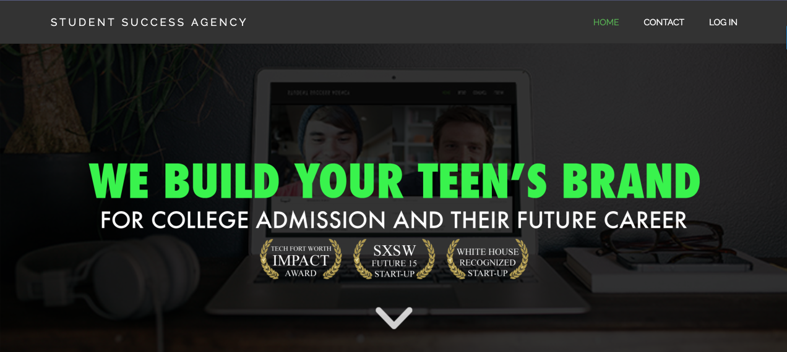
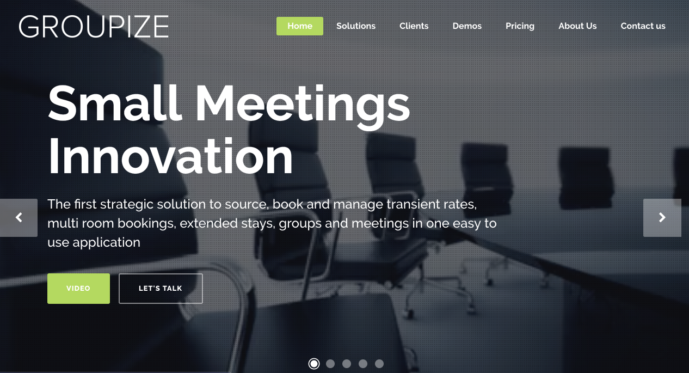
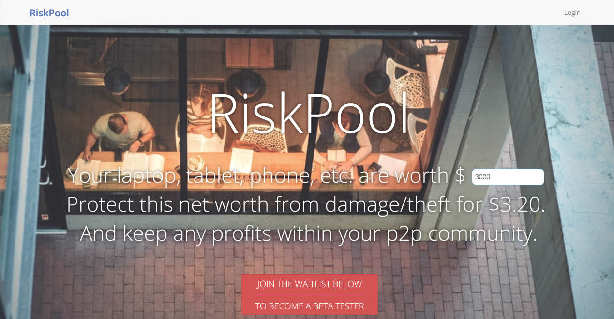

## Client Work

### [Student Success Agency](http://studentsuccess.co/)

 
Worked alongside the team at [Velocis LLC](http://velocis.us/)  from June to September 2016. The rails app uses twilio to route calls and text messages between high school students and college aged mentors who guide them through the college admissions process. Main tasks:

- Refactoring and performance tuning of CSV exports for the administrative site
- Creating a messaging system for routing emails to and from user's personal email accounts.

### [Groupize](https://groupize.com/)

 
Worked as part of the distributed development team at Groupize from December 2015 to May 2016. Groupize has a pair of rails apps which provide group travel sourcing for travel planners at firms and corporate travel departments and lead management software for group sales teams at hotels. Main tasks included:

- Adding and maintaining hotel user interface using Ruby on Rails and emberjs
- Creating a dashboard and email routing system for travel planner users using backbone js and Ruby on Rails.
- Keeping data in sync from the hotel and planner applications via their respective APIs

### [RiskPool](http://riskpool.co/)

Built out a beta version of a rails app for a peer-to-peer insurance platform. Worked as a solo contractor as well as on a small distributed team of contractors between Cleveland and New York. Main tasks included:

- Workflow for creation of self-insurance groups (pools) from user invitation to, petitioning to join a pool to acceptance into the pool and attendant permissions for these different user states/roles
- Tool for estimating premiums using react
- Domain logic for premiums, how much user's pay versus how much they have to keep etc.
- Administrative dashboard

## Open Source
On my github I have several open source projects, mainly tools to simplify common tasks.

### get_freaky
Wrapper for the confreaks API that permits browsing and downloading convention videos from the command line. Written as a ruby gem using the excellent commander and httparty gems for the command line interface and interacting with confreaks public api respectively. I write about this in greater detail in [this post](/get-freaky/) 
[site](https://rubygems.org/gems/get_freaky) | [source](https://github.com/smcabrera/get_freaky)

### dot_example
A command line tool for keeping configuration variables in sync across a team. Builds on using the dotenv gem and the convention of storing ENV variables in a `.env` file and automatically documents the changes in the keys for this file without the need for manual updating of a `.env.example` file.  
[site](https://rubygems.org/gems/dot_example) | [source](https://github.com/smcabrera/dot_example)

### enter
Very simple command line tool to make navigating projects with tmux easier.
[source](https://github.com/smcabrera/enter)

###  dotfiles
The name smcabrera/dotfiles is already taken up by my fork of thoughtbot/dotfiles. They say a man's home is his castle; "Castillo" is Spanish for "castle", and this repo is my portable home directory that I've taken with me from machine to machine. 
[source](https://github.com/smcabrera/castillo-cabrera)
